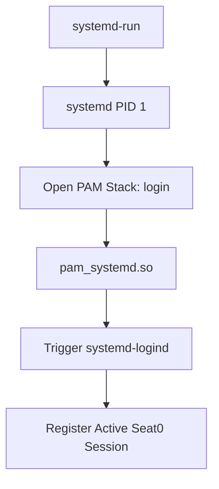

# Analysis of Graphical Session Startup

To initialize a secure, authenticated graphical user session from scratch, bypassing traditional display managers (like GDM or SDDM), the following command is used:

```bash
sudo systemd-run --collect -E XDG_SESSION_TYPE=wayland --uid=1000 -p PAMName=login -p TTYPath=/dev/tty1 sleep 1d
```

Executing this command initiates a complex interaction between `systemd`, PAM, and low-level Linux plumbing to "trick" the system into treating a background `sleep` command as a legitimate interactive graphical login session.

---

## Phase 1: The `systemd-run` Flow

### Step 1: The Blueprint and Handshake
When executed, `systemd-run` communicates with the **systemd system manager (PID 1)** over D-Bus.

*   **Action:** Requests the creation of a temporary, dynamic service unit (e.g., `run-r123456789.service`).
*   **Plumbing Interaction:** The `--collect` flag marks the unit as ephemeral. Systemd will wipe it from the cgroup tree the moment the process exits, leaving no failed unit history.

### Step 2: Privilege Allocation and Sandbox Routing
Before execution, systemd prepares the security context.

*   **Action:** Allocates execution to **User ID 1000**.
*   **Plumbing Interaction:** Because `PAMName=` is used, PID 1 remains root briefly. Initializing a PAM session requires root privileges to read security limits and write system logs before dropping privileges to the user.

### Step 3: Directing the Virtual Terminal
The service requires a physical or virtual space for standard I/O streams.

*   **Action:** Systemd opens `/dev/tty1` and duplicates it across file descriptors 0, 1, and 2.
*   **How the Plumbing is Tricked:** Background daemons usually route streams to `/dev/null`. By binding to a physical virtual console (`/dev/tty1`), the system believes a real screen and keyboard are attached. This satisfies **KMS/DRM kernel drivers**, which require an associated TTY controlling terminal for direct hardware access.

### Step 4: Activating the Authentication Stack
This is the core of the "trick," invoking the **Pluggable Authentication Module (PAM)** architecture.



*   **The Action:** systemd calls `pam_start("login", "user", ...)` and processes `/etc/pam.d/login`.
*   **Interaction Detail:**
    1.  `pam_securetty.so` & `pam_env.so`: Checks security policies for TTY1 and loads environment variables.
    2.  `pam_limits.so`: Sets kernel resource limits (max open files, etc.) based on user config.
    3.  `pam_systemd.so`: Intercepts the request and signals `systemd-logind`.
*   **The Result:** `logind` sees a login request from TTY1 and assigns a unique **Session ID**, attaches it to **seat0** (GPU/HID), and provisions the runtime directory (`/run/user/1000`).

### Step 5: Injecting the Graphical Context
With PAM configured, systemd injects environment modifications.

*   **Action:** Appends `XDG_SESSION_TYPE=wayland` to the environment block.
*   **Impact:** Overrides standard system detection. Any child process (like a compositor) will skip X11 fallback checks and immediately attempt to bind to Wayland protocols.

### Step 6: Executing the Payload
Finally, systemd performs an `execve()` system call.

*   **Action:** The process drops root privileges, switches to UID 1000, and executes `sleep 1d`.
*   **State:** A persistent, authenticated `logind` seat session is now active on TTY1, holding open the graphical hardware for other processes to use.

---

## Phase 2: Launching the Display Server

This phase bridges the environment preparation to the actual graphical display pipeline.

### 1. Initializing Weston
The following command launches the display server cleanly in the background:

```bash
(sleep 3s; systemctl --user start weston) & disown
```

#### Breakdown:
*   **`( ... )` (Sequential Group):** Groups commands to execute in order as a single unit.
*   **`sleep 3s` (Race-Condition Protection):** Ensures `systemd-run` has finished initializing the PAM session and `/run/user/1000` directory before Weston attempts to start.
*   **`systemctl --user start weston` (User-Level Service):** Launches Weston within the `droid` user's systemd instance. This ensures the display server owner matches the application owner, satisfying Linux security requirements.
*   **`&` (Background Routing):** Pushes the group to the background, returning terminal control immediately.
*   **`disown` (Process Decoupling):** Removes the task from the shell's tracking list, preventing it from being killed if the terminal session (SIGHUP) ends.

> [!TIP]
> **The Invisible Net:** Even if the terminal exits, the persistent `systemd-run` session on `/dev/tty1` prevents `systemd-logind` from sweeping away the critical graphical socket directories.

---

## Phase 3: Bridging the Terminal Gap

### 2. Setting the Display Environment
To allow applications in the current terminal to "see" the new display server:

```bash
export DISPLAY=:0
```

#### The Logic:
*   **The Isolation:** Your Android terminal runs on a pseudo-terminal (`/dev/pts/1`), while the graphics sandbox lives on a virtual console (`/dev/tty1`). They are naturally isolated.
*   **The Identifier (`:0`):** In X11/XWayland architecture, `:0` represents the first local graphical display.
*   **The Bridge (`export`):** By exporting `DISPLAY=:0`, you create a signpost. Any GUI application launched from this shell will read this variable and route its graphical instructions to the display server running on local screen zero instead of attempting to output to the command line.
